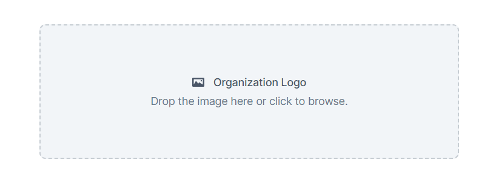

# 📸 Avatar Upload

Avatar Upload is a React Component to allow users to upload images to make it easier for them to recognize key interface elements related to an organization.

## 💻 Demo

### 🔗 [_You can look at the demo here_](https://)

<br />
<p align="center">
  
</p>
<br/>

## ✨ Tecnologias

Esse projeto foi desenvolvido com as seguintes tecnologias:

- [React](https://react.dev/)
- [TypeScript](https://www.typescriptlang.org/)
- [Styled Components](https://styled-components.com/)
- [React Dropzone](https://react-dropzone.js.org/)
- [React Avatar Editor](https://www.npmjs.com/package/react-avatar-editor)
- [Vitest](https://vitest.dev/)
- [Testing Library](https://testing-library.com/)

<br/>

## Getting Started

### First, clone this repo:

```bash
git clone https://github.com/lorenzoleite/avatar-upload.git
```

### Then, install all project dependencies:

```bash
yarn
```

### Run the development server:

```bash
yarn dev
```

### Open [http://127.0.0.1:5173/](http://127.0.0.1:5173/) with your browser to see the result.

<br/>

## ♾️ Test the application

Run the command below to execute all tests

```
yarn test
```

---

⌨️ por [Lorenzo Antônio Leite](https://www.linkedin.com/in/lorenzoleite/)
